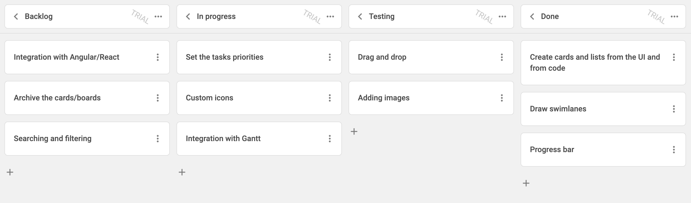

# Integration with React

:::tip
You should be familiar with the basic concepts and patterns of [**React**](https://react.dev) before reading this documentation. To refresh your knowledge, please refer to the [**React documentation**](https://reactjs.org/docs/getting-started.html).
:::

DHTMLX Kanban is compatible with **React**. We have prepared code examples on how to use DHTMLX Kanban with **React**. For more information, refer to the corresponding [**Example on GitHub**](https://github.com/DHTMLX/react-kanban-demo).

## Creating a project

:::info
Before you start to create a new project, install [**Vite**](https://vitejs.dev/) (optional) and [**Node.js**](https://nodejs.org/en/).
:::

You can create a basic **React** project or use **React with Vite**:

~~~json
npx create-vite my-react-kanban-app --template react
~~~

### Installation of dependencies

Go to the app directory. Let's name the project as **my-react-kanban-app** and run:

~~~json
cd my-react-kanban-app
~~~

Install dependencies and start the dev server. For this, use a package manager:

- if you use [**yarn**](https://yarnpkg.com/), run the following commands:

~~~json
yarn install
yarn dev
~~~

- if you use [**npm**](https://www.npmjs.com/), run the following commands:

~~~json
npm install
npm run dev
~~~

The app should run on a localhost (for instance `http://localhost:3000`).

## Creating Kanban

Now you should get the DHTMLX Kanban code. First of all, stop the app and proceed with installing the Kanban package.

### Step 1. Package installation

Download the [**trial Kanban package**](/how_to_start/#installing-kanban-via-npm-and-yarn) and follow steps mentioned in the README file. Note that trial Kanban is available 30 days only.

### Step 2. Component creation

Now you need to create a React component, to add a Kanban into the application. Create a new file in the ***src/*** directory and name it ***Kanban.jsx***.

#### Importing source files

Open the ***Kanban.jsx*** file and import Kanban source files. Note that:

- if you use PRO version and install the Kanban package from a local folder, the import paths look like this:

~~~jsx title="Kanban.jsx"
import { Kanban, Toolbar } from 'dhx-kanban-package';
import 'dhx-kanban-package/dist/kanban.css';
~~~

Note that depending on the used package, the source files can be minified. In this case make sure that you are importing the CSS file as ***kanban.min.css***.

- if you use the trial version of Kanban, specify the following paths:

~~~jsx title="Kanban.jsx"
import { Kanban, Toolbar } from '@dhx/trial-kanban';
import "@dhx/trial-kanban/dist/kanban.css";
~~~

In this tutorial you can see how to configure the **trial** version of Kanban.

#### Setting containers and adding Kanban with Toolbar

To display Kanban with Toolbar on the page, you need to create containers for Kanban and Toolbar, and initialize these components using the corresponding constructors:

~~~jsx {2,6-7,10-11,13-17} title="Kanban.jsx"
import { useEffect, useRef } from "react";
import { Kanban, Toolbar } from '@dhx/trial-kanban';
import '@dhx/trial-kanban/dist/kanban.css';

export default function KanbanComponent(props) {
    let toolbar_container = useRef(); // initialize container for Toolbar
    let kanban_container = useRef(); // initialize container for Kanban

    useEffect(() => {
        // initialize the Kanban component
        const kanban = new Kanban(kanban_container.current, {});

        // initialize the Toolbar component
        const toolbar = new Toolbar(toolbar_container.current, {
            api: kanban.api, // provide Kanban inner API
            // other configuration properties
        });

        return () => {
            kanban.destructor(); // destruct Kanban
            toolbar.destructor(); // destruct Toolbar
        };
    }, []);

    return  

                

                

            

}
~~~

#### Loading data

To add data into the Kanban, you need to provide a data set. You can create the ***data.js*** file in the ***src/*** directory and add some data into it:

~~~jsx {2,14,37,48} title="data.js"
export function getData() {
    const columns = [
        {
            label: "Backlog",
            id: "backlog"
        },
        {
            label: "In progress",
            id: "inprogress"
        },
        // ...
    ];

    const cards = [
        {
            id: 1,
            label: "Integration with Angular/React",
            priority: 1,
            color: "#65D3B3",
            start_date: new Date("01/07/2021"),
            users: [3, 2],
            column: "backlog",
            type: "feature",
        },
        {
            label: "Archive the cards/boards ",
            priority: 3,
            color: "#58C3FE",
            users: [4],
            progress: 1,
            column: "backlog",
            type: "feature",
        },
        // ...
    ];

    const rows = [
        {
            label: "Feature",
            id: "feature",
        },
        {
            label: "Task",
            id: "task",
        }
    ];

    return { columns, cards, rows };
}
~~~

Then open the ***App.js*** file and import data. After this you can pass data into the new created `<Kanban/>` components as **props**:

~~~jsx {2,5-6} title="App.jsx"
import Kanban from "./Kanban";
import { getData } from "./data";

function App() {
    const { columns, cards, rows } = getData();
    return <Kanban columns={columns} cards={cards} rows={rows} />;
}

export default App;
~~~

Go to the ***Kanban.jsx*** file and apply the passed **props** to the Kanban configuration object:

~~~jsx {5,11-14} title="Kanban.jsx"
import { useEffect, useRef } from "react";
import { Kanban, Toolbar } from "@dhx/trial-kanban";
import "@dhx/trial-kanban/dist/kanban.css";

export default function KanbanComponent(props) {
    let kanban_container = useRef();
    let toolbar_container = useRef();

    useEffect(() => {
        const kanban = new Kanban(kanban_container.current, {
            columns: props.columns, // apply column data
            cards: props.cards, // apply card data
            rows: props.rows, // apply row data
            rowKey: "type",
            // other configuration properties
        });

        const toolbar = new Toolbar(toolbar_container.current, {
            api: kanban.api,
            // other configuration properties
        });

        return () => {
            kanban.destructor();
            toolbar.destructor();
        };
    }, []);

    return  

                

                

            

}
~~~

You can also use the [`parse()`](/api/methods/js_board_parse_method/) method inside the `useEffect()` method of React to load data into Kanban:

~~~jsx {9-10,27} title="Kanban.jsx"
import { useEffect, useRef } from "react";
import { Kanban, Toolbar } from "@dhx/trial-kanban";
import "@dhx/trial-kanban/dist/kanban.css";

export default function KanbanComponent(props) {
    let kanban_container = useRef();
    let toolbar_container = useRef();

    let columns = props.columns; // data for columns
    let cards = props.cards; // data for cards
    let rows = props.rows; // data for rows

    useEffect(() => {
        const kanban = new Kanban(kanban_container.current, {
            columns: [],
            cards: [],
            rows: [],
            rowKey: "type",
            // other configuration properties
        });

        const toolbar = new Toolbar(toolbar_container.current, {
            api: kanban.api,
            // other configuration properties
        });
    
        kanban.parse({ columns, cards, rows });

        return () => {
            kanban.destructor();
            toolbar.destructor();
        };
    }, []);

    return  

                

                

            

}
~~~

The `kanban.parse(data)` method provides data reloading on each applied change.

Now the Kanban component is ready. When the element will be added to the page, it will initialize the Kanban object with data. You can provide necessary configuration settings as well. Visit our [Kanban API docs](/api/overview/properties_overview/) to check the full list of available properties.

#### Handling events

When a user makes some action in the Kanban, it invokes an event. You can use these events to detect the action and run the desired code for it. See the [full list of events](/api/overview/events_overview/).

Open ***Kanban.jsx*** and complete the `useEffect()` method in the following way:

~~~jsx {5-7} title="Kanban.jsx"
// ...
useEffect(() => {
    const kanban = new Kanban(kanban_container.current, {});

    kanban.api.on("add-card", (obj) => {
        console.log(obj.columnId);
    });
    
    return () => {
        kanban.destructor();
    };
}, []);
// ...
~~~

### Step 3. Adding Kanban into the app

To add the component into the app, open the ***App.jsx*** file and replace the default code with the following one:

~~~jsx title="App.jsx"
import Kanban from "./Kanban";
import { getData } from "./data";

function App() {
    const { columns, cards } = getData();
    return <Kanban columns={columns} cards={cards} rows={rows} />;
}

export default App;
~~~

After that, you can start the app to see Kanban loaded with data on a page.

Now you know how to integrate DHTMLX Kanban with React. You can customize the code according to your specific requirements. The final example you can find on [**GitHub**](https://github.com/DHTMLX/react-kanban-demo).
