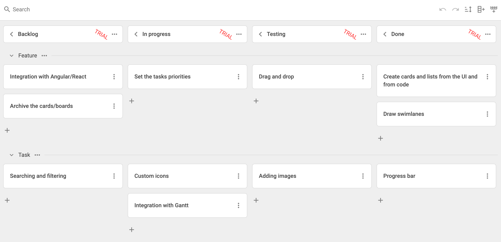

# Integration with Vue

:::tip
You should be familiar with the basic concepts and patterns of [**Vue**](https://vuejs.org/) before reading this documentation. To refresh your knowledge, please refer to the [**Vue 3 documentation**](https://v3.vuejs.org/guide/introduction.html#getting-started).
:::

DHTMLX Kanban is compatible with **Vue**. We have prepared code examples on how to use DHTMLX Kanban with **Vue 3**. For more information, refer to the corresponding [**Example on GitHub**](https://github.com/DHTMLX/vue-kanban-demo).

## Creating a project

:::info
Before you start to create a new project, install [**Node.js**](https://nodejs.org/en/).
:::

To create a **Vue** project, run the following command:

~~~json
npm create vue@latest
~~~

This command installs and executes `create-vue`, the official **Vue** project scaffolding tool. Check the details in the [Vue.js Quick Start](https://vuejs.org/guide/quick-start.html#creating-a-vue-application).

Let's name the project as **my-vue-kanban-app**.

### Installation of dependencies

Go to the app directory:

~~~json
cd my-vue-kanban-app
~~~

Install dependencies and start the dev server. For this, use a package manager:

- if you use [**yarn**](https://yarnpkg.com/), run the following commands:

~~~jsx
yarn
yarn start // or yarn dev
~~~

- if you use [**npm**](https://www.npmjs.com/), run the following commands:

~~~json
npm install
npm run dev
~~~

The app should run on a localhost (for instance `http://localhost:3000`).

## Creating Kanban

Now you should get the DHTMLX Kanban source code. First of all, stop the app and proceed with installing the Kanban package.

### Step 1. Package installation

Download the [**trial Kanban package**](/how_to_start/#installing-kanban-via-npm-and-yarn) and follow steps mentioned in the README file. Note that trial Kanban is available 30 days only.

### Step 2. Component creation

Now you need to create a Vue component, to add Kanban with Toolbar into the application. Create a new file in the ***src/components/*** directory and name it ***Kanban.vue***.

#### Import source files

Open the ***Kanban.vue*** file and import Kanban source files. Note that:

- if you use PRO version and install the Kanban package from a local folder, the import paths look like this:

~~~html title="Kanban.vue"

~~~

Note that depending on the used package, the source files can be minified. In this case make sure that you are importing the CSS file as **kanban.min.css**.

- if you use the trial version of Kanban, specify the following paths:

~~~html title="Kanban.vue"

~~~

In this tutorial you can see how to configure the **trial** version of Kanban.

#### Setting containers and adding Kanban with Toolbar

To display Kanban with Toolbar on the page, you need to create containers for Kanban and Toolbar, and initialize these components using the corresponding constructors:

~~~html {2,7-8,10-14} title="Kanban.vue"

<template>
    

        

        

    

</template>
~~~

#### Adding styles

To display Kanban correctly, you need to specify important styles for Kanban and its container in the main css file of the project:

~~~css title="main.css"
/* specify styles for initial page */
html,
body,
#app { /* make sure that you use the #app root container */
    height: 100%;
    padding: 0;
    margin: 0;
}

/* specify styles for Kanban and Toolbar container */
.component_container {
    height: 100%; 
    margin: 0 auto;
}

/* specify styles for Kanban container */
.widget {
    height: calc(100% - 56px);
}
~~~

#### Loading data

To add data into the Kanban, you need to provide a data set. You can create the ***data.js*** file in the ***src/*** directory and add some data into it:

~~~jsx {2,14,37,48} title="data.js"
export function getData() {
    const columns = [
        {
            label: "Backlog",
            id: "backlog"
        },
        {
            label: "In progress",
            id: "inprogress"
        },
        // ...
    ];

    const cards = [
        {
            id: 1,
            label: "Integration with Angular/React",
            priority: 1,
            color: "#65D3B3",
            start_date: new Date("01/07/2021"),
            users: [3, 2],
            column: "backlog",
            type: "feature",
        },
        {
            label: "Archive the cards/kanbans ",
            priority: 3,
            color: "#58C3FE",
            users: [4],
            progress: 1,
            column: "backlog",
            type: "feature",
        },
        // ...
    ];

    const rows = [
        {
            label: "Feature",
            id: "feature",
        },
        {
            label: "Task",
            id: "task",
        }
    ];

    return { columns, cards, rows };
}
~~~

Then open the ***App.vue*** file, import data, and initialize it via the inner `data()` method. After this you can pass data into the new created `<Kanban/>` component as **props**:

~~~html {3,8,10-12,19} title="App.vue"

<template>
    <Kanban :columns="columns" :cards="cards" :rows="rows"/>
</template>
~~~

Go to the ***Kanban.vue*** file and apply the passed **props** to the Kanban configuration object:

~~~html {6,10-12} title="Kanban.vue"

<template>
    

        

        

    

</template>
~~~

You can also use the [`parse()`](/api/methods/js_kanban_parse_method/) method inside the `mounted()` method of Vue to load data into Kanban:

~~~html {6,22-26} title="Kanban.vue"

<template>
    

        

        

    

</template>
~~~

The `parse(data)` method provides data reloading on each applied change.

Now the Kanban component is ready to use. When the element will be added to the page, it will initialize the Kanban with data. You can provide necessary configuration settings as well. Visit our [Kanban API docs](/api/overview/properties_overview/) to check the full list of available properties.

#### Handling events

When a user makes some action in the Kanban, it invokes an event. You can use these events to detect the action and run the desired code for it. See the [full list of events](/api/overview/events_overview/).

Open ***Kanban.vue*** and complete the `mounted()` method:

~~~html {8-10} title="Kanban.vue"

// ...
~~~

After that, you can start the app to see Kanban loaded with data on a page.

Now you know how to integrate DHTMLX Kanban with Vue. You can customize the code according to your specific requirements. The final advanced example you can find on [**GitHub**](https://github.com/DHTMLX/vue-kanban-demo).
