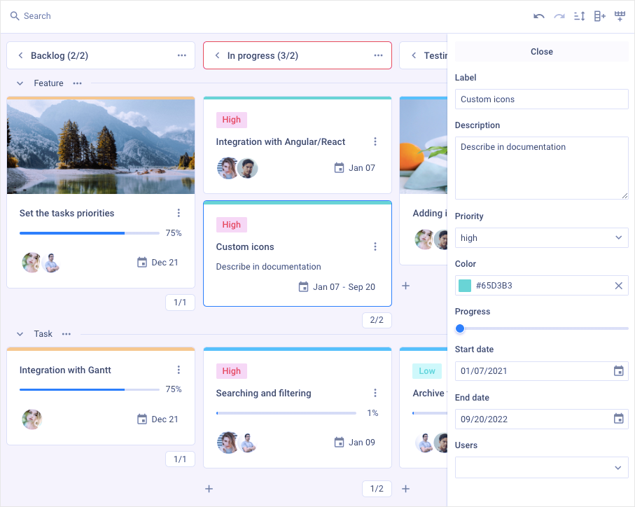

# How to Start

This clear and comprehensive tutorial will guide your through the steps you need to take in order to get a full-functional JS Kanban on a page.



## Step 1. Including source files

Start from creating an HTML file and call it *index.html*. Then proceed to include JS Kanban source files into the created file.

There are two necessary files:

- the JS file of JS Kanban
- the CSS file of JS Kanban

and

- the link to the Google Fonts source file for the correct rendering of fonts.

```html {5,7-9} title="index.html"
<!DOCTYPE html>
<html>
	<head>
		<title>How to Start with JS Kanban</title>
		<script src="./dist/kanban.js"></script>   

		<link href="./dist/kanban.css" rel="stylesheet">
		<link href="https://fonts.googleapis.com/css?family=Roboto:400,500"
		rel="stylesheet">
	</head>
	<body>
		<script>
		// your code will be here
		</script>
	</body>
</html>
```

## Step 2. Creating JS Kanban

Now you are ready to add JS Kanban to the page. First, let's create the DIV containers for JS Kanban and its Toolbar. So, take the following steps:

- specify two DIV containers in the *index.html* file
- initialize JS Kanban and its Toolbar using the **kanban.Kanban** and **kanban.Toolbar** constructors

:::info
The Toolbar is an optional part of the JS Kanban interface. To create JS Kanban without Toolbar, you can specify only one DIV container and initialize the widget via the **kanban.Kanban** constructor  
:::

As parameters, the constructors take the HTML containers where the JS Kanban and Toolbar will be placed into and the corresponding configuration objects.

```html {12-13,16,20} title="index.html"
<!DOCTYPE html>
<html>
	<head>
		<title>How to Start with JS Kanban</title>
		<script src="./dist/kanban.js"></script>   

		<link href="./dist/kanban.css" rel="stylesheet">  
		<link href="https://fonts.googleapis.com/css?family=Roboto:400,500"
		rel="stylesheet">
	</head>
	<body>
		<div id="toolbar"></div>
		<div id="root"></div>

		<script>
			const board = new kanban.Kanban("#root", {
				// configuration properties
			});

			new kanban.Toolbar("#toolbar",{
				// configuration properties
			});
		</script>
	</body>
</html>
```

## Step 3. Configuring JS Kanban

Next you can specify configuration properties you want the JS Kanban component to have when initialized.

To start working with JS Kanban, first you need to provide the initial data for **cards** and **columns** (and *rows*).
Beside the initial data, you can configure the [cards](../guides/configuration#cards), [editor](../guides/configuration#editor) and [toolbar](../guides/configuration#toolbar) appearance.

```js {2-7,11-15}
const board = new kanban.Kanban("#root", {
	cards,
	columns,
	rows,
	rowKey: "row",
	cardShape,
	editorShape
});

new kanban.Toolbar("#toolbar", {
	api: board.api,
	items: [
		"search",
		"controls"
	]
});
```

## What's next

That's all. Just three simple steps and you have a handy tool for visualizing and managing the workflow. Now you can start working with your tasks or keep exploring the inner world of JS Kanban.
