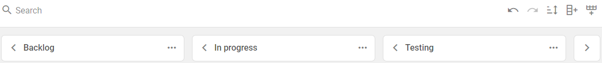

# DHTMLX Kanban overview

JavaScript Kanban is an effective solution for the workflow visualization. The widget helps you better understand your business processes and gain an overview of your team workload. This flexible tool can work with any number of cards, columns and swimlanes. Fully written in pure JavaScript and CSS, the component can be easily set and customized as well as integrated into any web app or web page.

## Kanban structure­

### Toolbar

**Toolbar** of Kanban is a separate part of the interface. It includes a search bar for *searching* cards, a control for *sorting* cards by the specified parameters, two controls for managing history (*undo/redo*) and controls for *adding new columns and rows*. You can flexibly manage the searching and sorting logic as well as change the Toolbar structure by adding custom elements or changing the order of the built-in ones. Read more in the [Configuration](./guides/configuration#toolbar) section.

### Board

The **Board** is main part of Kanban. It consists of the cards distributed into columns and rows (swimlanes). You can flexibly configure the cards appearance as well as apply a custom template. Read more in the [Configuration](./guides/configuration#cards) section.

On the **Board** panel you can work with the ***cards***, ***columns*** and ***rows*** in the following way:

- add new cards by clicking on the plus icon (in accordance with the specified *limits* for each column and swimlane)
- add comments and votes for tasks via the editor panel ([Example](https://snippet.dhtmlx.com/5hcx01h4?tag=kanban))
- set links between tasks via the editor ([Example](https://snippet.dhtmlx.com/81qu7qh0?tag=kanban))
- delete cards, columns and rows using a context menu (a 3 dots icon)
- duplicate cards using a context menu (a 3 dots icon) or the `Ctrl (Command)`+`D` shortcuts (allows duplicating multiple cards)
- export Kanban data to a JSON file
- managing Kanban history using the following shortcuts:
    - `Ctrl (Command)`+`Z` - reverts the last operation in Kanban (one step back in the Kanban history)
    - `Ctrl (Command)`+`Y` or `Ctrl (Command)`+`Shift`+`Z` - repeats the operation that was reverted by the *undo* action (one step forward in the Kanban history)
- move cards by dragging them into desired place (row and column)
- move columns and rows using a context menu (a 3 dots icon)
- rename columns and rows by double clicking on the corresponding labels or using a context menu (a 3 dots icon)
- display a card editor by clicking on the card
- collapse/uncollapse rows by clicking on the arrow icon on the left of the row label
- collapse/uncollapse columns by clicking on the arrow icon on the left of the column label
- select multiple cards using the following shortcuts:
    - `Shift` +  clicking on the corresponding cards, to select multiple cards in the same column
    - `Ctrl (Command)` + clicking on the corresponding cards, to select multiple cards in different columns

### Editor

The **Editor** is a modal panel that consists of the fields and controls for managing the selected card data. To display the editor, click on the card you want to change. You can flexibly configure the editor structure by adding new fields and controls. Read more in the [Configuration](./guides/configuration#editor) section.

## What's next

Now you can get down to using Kanban in your application. Follow the directions of the [How to start](./how_to_start) tutorial for guidance.
