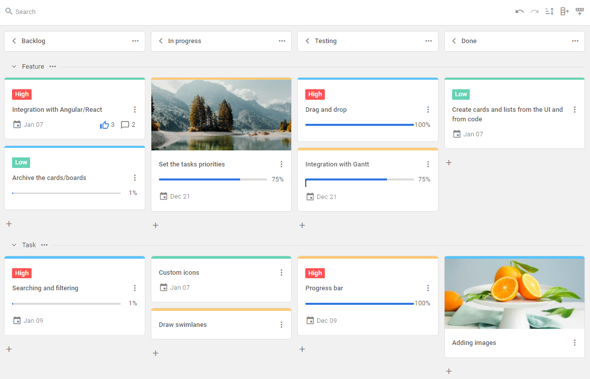
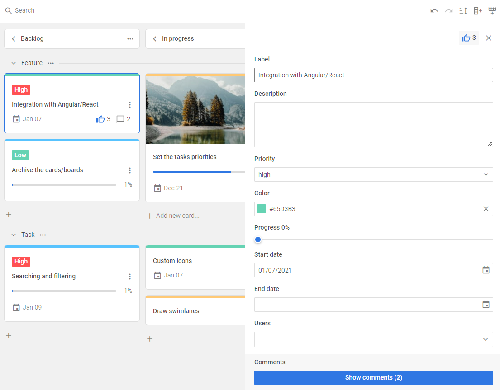

# JavaScript Kanban overview

JavaScript Kanban is an effective solution for the workflow visualization. The widget helps you better understand your business processes and gain an overview of your team workload. This flexible tool can work with any number of cards. Fully written in pure JavaScript and CSS, the component can be easily set and customized as well as integrated into any web app or web page.

## Kanban structure

### Toolbar

The **Toolbar** of Kanban is a separate part of the interface. It includes a ***search bar*** for searching the needed cards and ***special controls*** for adding new columns and rows. You can change the toolbar structure by adding custom elements or changing the order of the built-in controls. Read more in the [Configuration](./guides/configuration#toolbar) section.

### Board

The **Board** is the main part of Kanban. It consist of the ***cards*** distributed into *columns* and *rows*. You can flexibly configure the cards appearance as well as apply a custom template. Read more in the [Configuration](./guides/configuration#cards) section.

On the **Board** panel you can work with the ***cards***, ***columns*** and ***rows*** in the following way:

- add new cards by clicking on the plus icon
- delete cards, columns and rows using the 3 dots icon
- move cards by dragging them into desired place (row and column)
- rename columns and rows by double clicking on the corresponding labels
- display a card editor by clicking on the needed card
- show/hide the rows by clicking on the triangle icon on the left of the row label

### Editor

The **Editor** is a modal panel that consist of the fields and controls for managing the selected card data. To display the editor, click on the card you want to change. You can flexibly configure the editor structure by adding new fields and controls. Read more in the [Configuration](./guides/configuration#editor) section.

## What's next

Now you can get down to using Kanban in your application. Follow the directions of the [How to start](./how_to_start) tutorial for guidance.
